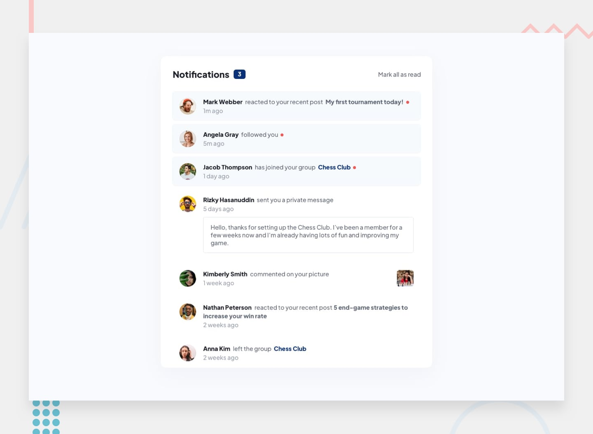
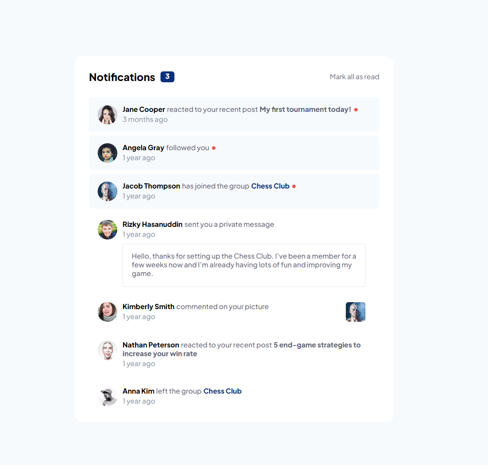
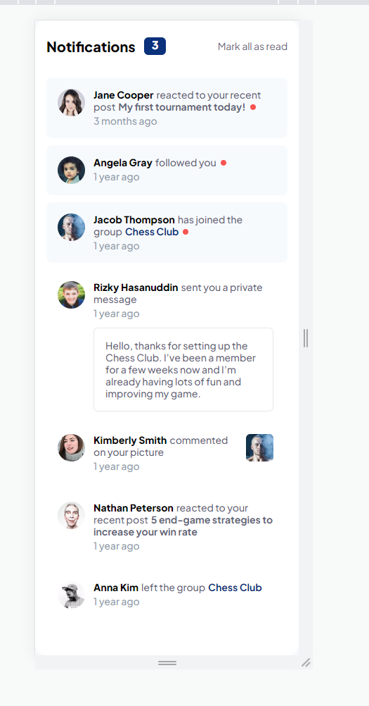

# Frontend Mentor - Notifications page

## Table of contents

- [Welcome](#welcome!)
  - [The challenge](#the-challenge)
  - [Screenshot](#screenshot)
  - [Links](#links)
  - [Built with](#built-with)

## Welcome!

This is a solution to the [Notifications page challenge on Frontend Mentor](https://www.frontendmentor.io/challenges/notifications-page-DqK5QAmKbC). Frontend Mentor challenges help you improve your coding skills by building realistic projects. 

### The challenge

Users should be able to:

- Distinguish between "unread" and "read" notifications
- Select "Mark all as read" to toggle the visual state of the unread notifications and set the number of unread messages to zero
- View the optimal layout for the interface depending on their device's screen size
- See hover and focus states for all interactive elements on the page

### Screenshot

### Links
- Solution URL: [here](https://github.com/AntonioTrupac/notifications)
- Live Site URL: [here](https://63e401adf594600008b68425--statuesque-sunburst-5c5894.netlify.app/)

### Built with
- React Typescript
- Tailwind CSS
- Flexbox layout
- Desktop First workflow